```
단축키
ctrl + shift + f 파일찾기
ctrl + p 파라미터값 찾기 
```


# Properties 정리

```markdown
- layout_gravity 는 뷰의 정렬
- gravity 는 안의 내용 정렬을 의미한다.
- layout_margin은 다른 뷰와의 거리를 의미한다(여백)
- padding이란 뷰안의 글자가 얼마나 떨어져있는지 정의할때 사용된다.
- textSize 글자 크기조정 (단위는 Sp를 권장, DP를써도 상관x)
- testcolor 에서 #을 붙이고16진수로 색을지정할수있음
- baseline은 여러개의 뷰를 추가할때 그뷰의 글자를 어떤 기준에따라 맞추고싶을때
- background 배경색 
- layout-weight는 남은 영역을 할당해준다.
- lineSpacingExtra : 줄간격

```


devideClick는 activity_main.xml에서 오른쪽의 propertise의 onClick에서 설정할 수 있고

method devideClick를 정의한다는 뜻이다.

그리고 MainActivity.java로가서 다음과같이 만든다.

이것은 나누기를 하는 예시이다.

```
   public void devideClick(View v){
        EditText number1 = (EditText) findViewById(R.id.number1);
        EditText number2 = (EditText) findViewById(R.id.number2);
        TextView result = (TextView) findViewById(R.id.result);
        float n1 =  Float.parseFloat(number1.getText().toString());
        float n2 = Float.parseFloat(number2.getText().toString());
        result.setText(Float.toString(n1 / n2));
        }
```

이것은 더하기를 하는 예시이다.

```
    public void addClick(View v){
    EditText number1 = (EditText) findViewById(R.id.number1);
    EditText number2 = (EditText) findViewById(R.id.number2);
    TextView result = (TextView) findViewById(R.id.result);
    int n1 = Integer.parseInt(number1.getText().toString());
    int n2 = Integer.parseInt(number2.getText().toString());
    result.setText(Integer.toString(n1+n2));
    }
```

그리고 Toast 라고 화면 아래에 나오는 메세지가 나오도록 할 수도 있다.

잠깐 보였다가 사라진다.

```
    public void sayhello(View v){
        Toast.makeText(this, "안녕하세요", Toast.LENGTH_LONG).show();
    }
```

그리고 버튼이 제위치에 없을때도있는데 다음과 같은 코드를 추가해주고 버튼위치를다시 조절하면 된다.

```
  	    app:layout_constraintBottom_toBottomOf="parent"
        app:layout_constraintLeft_toLeftOf="parent"
        app:layout_constraintRight_toRightOf="parent"
        app:layout_constraintTop_toTopOf="parent"
        app:layout_constraintVertical_bias="0.01"
        app:layout_constraintHorizontal_bias="0.111"
```

웹페이지 띄우는 코드

```
    public void webPageClicked(View v){
        Intent intent = new Intent(Intent.ACTION_VIEW, Uri.parse("http://m.naver.com"));
        startActivity(intent);
    }
```

# 레이아웃 (배치)


- 뷰란 화면을 구성하고 있는 모든 요소를 뷰라고한다.
- 뷰를 여러가 담고있는 것을 뷰 그룹이라고 부른다.
- 배치에 관련된 것을 레이아웃 이라고한다.

constraint란 버튼을 만들었을때 연결선을 이용하여 버튼의 위치를 잡는것

- 리니어 레이아웃 :박스모델
- 상대 레이아웃 : 규칙 기반 모델 (부모 컨테이너나 다른 뷰와의 상대적 위치로 화면을 구성하는 방법) 
- 프레임 레이아웃: 싱글(single)모델 
  - 가장 상위에 있는 하나의 뷰 또는 뷰그룹만 보여주는 방법
  - 여러 개의 뷰가 들어가면 중첩하여 쌓게 됨. 가장 단순하지만 여러 개의 뷰를 중첩한 후 각 뷰를 전환하여 보여주는 방식으로 자주 사용함
- 테이블 레이아웃
  - 격자(GIRD) 모델
  - 격자 모양의 배열을 사용하여 화면을 구성하는 방법
  - HTML에서 많이 사용하는 정렬 방식과 유사하지만 많이 사용하지는 않음
- 마진 (얼마나 떨어져있는지를 정의)

# view all properties

- layout_gravity 는 뷰의 정렬

- gravity 는 안의 내용 정렬을 의미한다.

- layout_margin은 다른 뷰와의 거리를 의미한다(여백)

- padding이란 뷰안의 글자가 얼마나 떨어져있는지 정의할때 사용된다.

- textSize 글자 크기조정 (단위는 Sp를 권장, DP를써도 상관x)

- testcolor 에서 #을 붙이고16진수로 색을지정할수있음

- baseline은 여러개의 뷰를 추가할때 그뷰의 글자를 어떤 기준에따라 맞추고싶을때

- background 배경색 

- layout-weight는 남은 영역을 할당해준다.

  - ```
    #layout- weight 예시
    <Button
        android:id="@+id/button4"
        android:layout_width="0dp"
        android:layout_height="wrap_content"
        android:layout_weight="2"
        android:text="Button" />

    <Button
        android:id="@+id/button5"
        android:layout_width="0dp"
        android:layout_height="wrap_content"
        android:layout_weight="1"
        android:text="Button" />
    ```

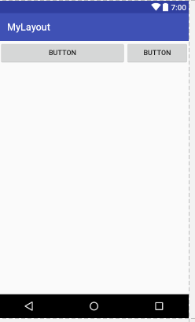


이런식으로 버튼이 2:1로 만들어진다. 수치를 바꾸면1:1도가능하다.

# 상대레이아웃 RelativeLayout

```
 <Button
        android:id="@+id/button"
        android:layout_width="match_parent"
        android:layout_height="wrap_content"
        android:layout_alignParentLeft="true"
        android:layout_alignParentStart="true"
        android:layout_alignParentTop="true"
        android:text="Button" />

    <Button
        android:id="@+id/button2"
        android:layout_width="match_parent"
        android:layout_height="match_parent"
        android:layout_alignParentLeft="true"
        android:layout_alignParentStart="true"
        android:layout_below="@+id/button"
        android:layout_above="@+id/button3"
        android:text="Button" />

    <Button
        android:id="@+id/button3"
        android:layout_width="match_parent"
        android:layout_height="wrap_content"
        android:layout_alignParentBottom="true"
        android:layout_alignParentLeft="true"
        android:layout_alignParentStart="true"

        android:text="Button" />
```

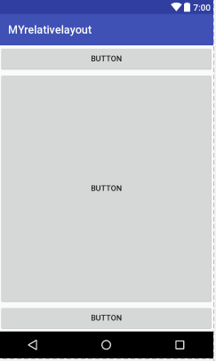

이런식으로 구성할 수 있다.

실제로 많이쓰는 구성이다.


# 테이블 레이아웃

  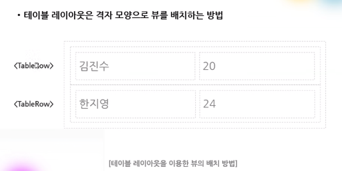

테이블레이아웃

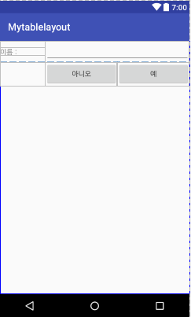

코드는 다음과 같다.

```
<?xml version="1.0" encoding="utf-8"?>
<TableLayout xmlns:android="http://schemas.android.com/apk/res/android"
    android:layout_width="match_parent" android:layout_height="match_parent"
    android:stretchColumns="0,1,2">


    <TableRow>
        android: layout_width="match_parent"
        android: layout_height="wrap_content"

        <TextView
            android:layout_width="wrap_content"
            android:layout_height="wrap_content"
            android:text="이름 :"
            />
        <EditText
            android:layout_width="wrap_content"
            android:layout_height="wrap_content"
            android:layout_span="2"
            />
    </TableRow>

    <TableRow>
        android:layout_width="match_parent"
        android:layout_height="wrap_content">

        <Button
            android:layout_width="wrap_content"
            android:layout_height="wrap_content"
            android:text="아니오"
            android:layout_column="1"
            />

        <Button
            android:layout_width="wrap_content"
            android:layout_height="wrap_content"
            android:text="예"
            android:layout_column="2"
            />
    </TableRow>

</TableLayout>
```


# 스크롤뷰 사용하기

- 안드로이드는 위젯의 내용이 화면 영역을 벗어나면 스크롤표시가 자동으로 보임
- 스크롤뷰를 이용해 다른 뷰를 감싸주기만 하면 됨

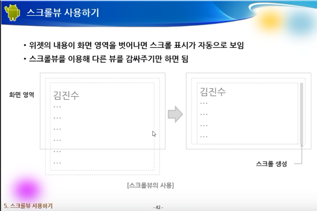


- 이런식으로 감싸주면 텍스트뷰의 크기가 커지면 알아서 스크롤이 생성됨

```
    <ScrollView
        android:layout_width="match_parent"
        android:layout_height="match_parent">
        
        <TextView
            android:= "@+id/textView"
            android:layout_width="match_parent"
            android:layout_height="match_parent" 
            />
        
    </ScrollView>
```

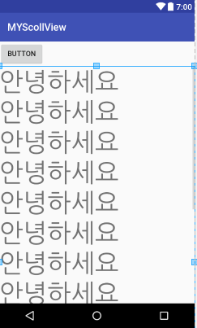

- 코드는다음과같다.

```
<?xml version="1.0" encoding="utf-8"?>
<LinearLayout xmlns:android="http://schemas.android.com/apk/res/android"
    android:layout_width="match_parent"
    android:layout_height="match_parent"
    android:orientation="vertical" >


    <Button
        android:id="@+id/button"
        android:layout_width="wrap_content"
        android:layout_height="wrap_content"
        android:text="Button"

         />

    <ScrollView
        android:layout_width="match_parent"
        android:layout_height="match_parent">

        <LinearLayout
            android:layout_width="match_parent"
            android:layout_height="wrap_content"
            android:orientation="vertical" >

            <TextView
                android:id="@+id/textView"
                android:layout_width="match_parent"
                android:layout_height="wrap_content"
                android:text="안녕하세요\n안녕하세요\n안녕하세요\n안녕하세요\n안녕하세요\n안녕하세요\n안녕하세요\n안녕하세요\n안녕하세요\n안녕하세요\n안녕하세요\n안녕하세요\n"
                android:textSize="50dp" />
        </LinearLayout>
    </ScrollView>

</LinearLayout>

```


# 프레임 레이아웃과 뷰의 전환


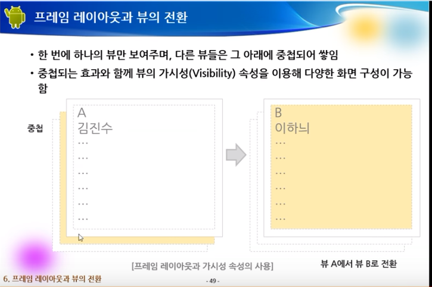


### 사진넣는법

`res/drawable`안에 복사 붙여넣기 하면된다.

- 그리고 palette에서 images> imageView

# 화면이 바뀌는 버튼 만들기

버튼을 누를때마다 화면이 바뀌는 페이지를 만들어보자

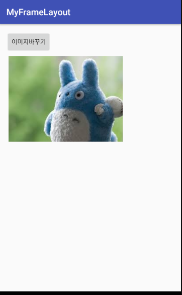

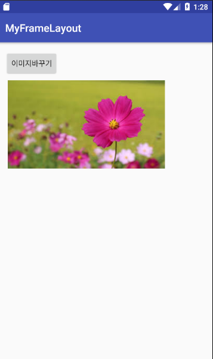

코드는 다음과 같다

```
package com.rememberme.myframelayout;

import android.support.v7.app.AppCompatActivity;
import android.os.Bundle;
import android.view.View;
import android.widget.ImageView;

public class MainActivity extends AppCompatActivity {
    ImageView imageView;
    ImageView imageView2;
    int index = 0;
    @Override
    protected void onCreate(Bundle savedInstanceState) {
        super.onCreate(savedInstanceState);
        setContentView(R.layout.activity_main);
        imageView = (ImageView) findViewById(R.id.imageView);
        imageView2 = (ImageView) findViewById(R.id.imageView2);

    }
//   R은 RES를뜻한다.
//    변수의 scope 때문에 위에서 클래스에서 선언을 해야 아래 메소드에서도 접근 가능하다.

    public void onButton1Click(View v){
        index += 1;
        if (index >1) {
            index = 0;
        }

        if (index==0){
            imageView.setVisibility(View.VISIBLE);
            imageView2.setVisibility(View.INVISIBLE);
        }else if (index==1){
            imageView.setVisibility(View.INVISIBLE);
            imageView2.setVisibility(View.VISIBLE);
        }
    }
}


```


# 기봇위젯

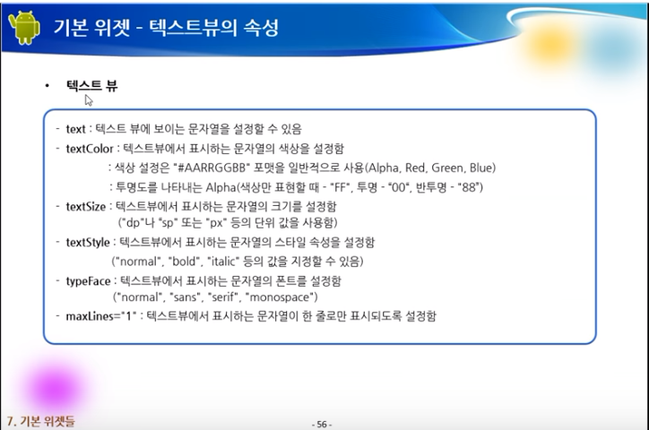

- lineSpacingExtra : 줄간격

### 기본적인 위젯 구성이다.

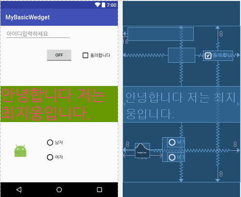

만약 자바코드에서 버튼에 있는 값을 받고 싶다면 코드는 다음과 같다.

```
RadioButton radioButton = (RadioButton) findViewById(R.id.radioButton2);
RadioButton radioButton1 = (RadioButton) findViewById(R.id.radioButton3);
```


### XML에서 여러가지 속성을 줄때 |를사용한다.

- ```
  android:gravity="left|center_vertical"
  ```

  ​

